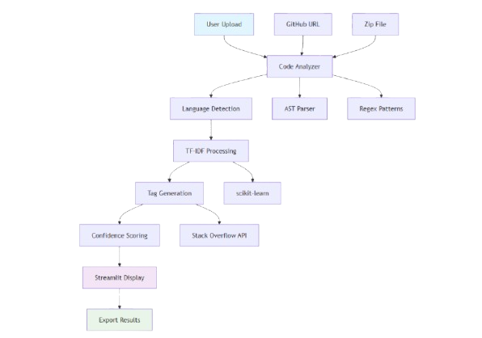

# Smart Code Tagger

AI-powered codebase analyzer and tag suggester. The tool scans source code, README files, comments and identifiers, then uses a language-aware TF-IDF pipeline to propose relevant tags (language, technology, domain, and quality indicators) with confidence scores. It includes a Streamlit front-end for exploration and exporting results.

## Highlights

- Multi-source analysis: docstrings, comments, identifiers, imports and README content
- Language-aware TF-IDF with domain boosting to surface meaningful terms
- Tag suggestion engine with confidence scoring and Stack Overflow validation
- Streamlit UI for interactive inspection and exporting (CSV / JSON / Markdown)
- Sample project generator for quick demos

## Repository layout

- `app.py` — Streamlit application and UI
- `src/code_tagger/` — core modules:
  - `analyzer.py` — code parsing and extraction (AST + regex)
  - `tfidf_processor.py` — TF-IDF feature extraction and domain/quality scoring
  - `tag_engine.py` — tag suggestion logic and SO validation
- `sample_repos/` — created sample projects used by the demo
- `tests/` — basic unit test(s) for the analysis pipeline

## Quick start (Windows PowerShell)

1. Create and activate a virtual environment:

```powershell
python -m venv .venv; .\.venv\Scripts\Activate.ps1
```

2. Install dependencies:

```powershell
pip install -r requirements.txt
```

3. Run the Streamlit app:

```powershell
streamlit run app.py
```

Open the URL shown by Streamlit in your browser. Use the UI to upload a ZIP, paste a GitHub repo URL, or try one of the sample projects.

## How to use

- Upload a ZIP containing source files or paste a public GitHub repository URL.
- The analyzer will (1) parse files, (2) extract docstrings/comments/identifiers/imports, (3) build TF-IDF features, and (4) generate tag suggestions with confidence and reasoning.
- Use sidebar options to tune min-confidence, max tags, and which tag categories to include.
- Export suggestions as CSV, JSON or Markdown.

## Development

Run tests (recommended inside the virtual environment):

```powershell
.\.venv\Scripts\Activate.ps1
pip install -r requirements.txt
pytest -q
```

Code modules of interest:
- `src/code_tagger/analyzer.py` — Walks the repository, detects languages, extracts docstrings/comments/imports/identifiers.
- `src/code_tagger/tfidf_processor.py` — Builds TF-IDF vectors, applies domain/quality boosts, returns top terms and quality signals.
- `src/code_tagger/tag_engine.py` — Heuristics to map TF-IDF signals to human-readable tags and boost/validate against common Stack Overflow tags.

## Sample repos (from UI)

The app can create quick sample projects (ML, Web API, React) placed under `sample_repos/`. These are helpful to try the full pipeline without uploading your own repo.

## Notes & design

- Primary language detection is based on file extensions with a Pygments fallback.
- The TF-IDF processor weights imports and documentation more heavily to favor technology and intent signals.
- Tag suggestions include reasoning and confidence level (`Very High` → `Very Low`) to help triage.

## Architecture diagram

Below is an architecture diagram illustrating the main components and data flow of Smart Code Tagger. This image was derived from the repository's mermaid diagram and is included in the project at `assets/diag.png`.



Figure: Architecture diagram — based on `mermaid_diagram.md` and `architecture_diagram.md` in the repo.

## Contributing

1. Fork the repo and create a branch for your feature.
2. Run and add tests for new behavior (`pytest`).
3. Submit a PR with a clear description and any design notes.

## License & Contact

This project is provided as-is. Add a LICENSE file if you intend an explicit license.

If you want help improving the README further (badges, CI instructions, packaging), tell me which parts to expand or what style you'd like.
If you want help improving the README further (badges, CI instructions, packaging), tell me which parts to expand or what style you'd like.

## Architecture diagram
Below is an architecture diagram illustrating the main components and data flow of Smart Code Tagger. The image was generated from the project's mermaid diagram and saved as `assets/diag.png`.


Figure: Architecture diagram — based on `mermaid_diagram.md` (and `architecture_diagram.md` in the repo).
## Features
Turn a long document into an interactive concept graph of the most important terms and how they co-occur.

## Quick Start
Quickstart

1. Install dependencies:

```bash
1. Create a virtual environment and install dependencies:

pip install -r requirements.txt

``````powershell

python -m venv .venv; .\.venv\Scripts\Activate.ps1

2. Run the analyzer:pip install -r requirements.txt

```bash```

streamlit run app.py

```2. Run the Streamlit app:


3. Upload a codebase (zip file or folder) and get instant tag suggestions!```powershell

streamlit run app.py

## How It Works```


1. **Code Analysis**: Parses source files to extract meaningful text contentNotes

2. **Language Detection**: Identifies programming languages and applies specific term weighting- The app uses TF-IDF from scikit-learn to extract top keywords per paragraph and constructs an undirected co-occurrence graph.

3. **TF-IDF Processing**: Analyzes term frequency patterns across different code elements- Clustering is optional and uses KMeans over keyword vectors built from paragraph TF-IDF columns.

4. **Tag Classification**: Maps analysis results to hierarchical tag categories

5. **Confidence Scoring**: Provides reasoning and confidence levels for each suggestionFiles

- `app.py` - Streamlit UI

## Sample Analysis- `src/concept_map/analysis.py` - TF-IDF and graph construction

- `src/concept_map/visualize.py` - pyvis integration

Upload any GitHub repository and see tags like:- `tests/test_analysis.py` - simple unit tests

- `machine-learning` (detected TensorFlow imports + ML terminology)

- `web-framework` (React/Vue patterns + REST API code)Next steps

- `well-documented` (high doc-to-code ratio)- Improve keyword extraction (use RAKE or spaCy noun chunks)

- `performance-critical` (optimization comments + complexity metrics)- Add weighting by TF-IDF score when building edges

- Add export (PNG/SVG/GraphML)

Perfect for GitHub repo tagging, project discovery, and code quality assessment.
# Smart Code Tagger

AI-powered codebase analyzer and tag suggester. The tool scans source code, README files, comments and identifiers, then uses a language-aware TF-IDF pipeline to propose relevant tags (language, technology, domain, and quality indicators) with confidence scores. It includes a Streamlit front-end for exploration and exporting results.

## Highlights

- Multi-source analysis: docstrings, comments, identifiers, imports and README content
- Language-aware TF-IDF with domain boosting to surface meaningful terms
- Tag suggestion engine with confidence scoring and Stack Overflow validation
- Streamlit UI for interactive inspection and exporting (CSV / JSON / Markdown)
- Sample project generator for quick demos

## Repository layout

- `app.py` — Streamlit application and UI
- `src/code_tagger/` — core modules:
  - `analyzer.py` — code parsing and extraction (AST + regex)
  - `tfidf_processor.py` — TF-IDF feature extraction and domain/quality scoring
  - `tag_engine.py` — tag suggestion logic and SO validation
- `sample_repos/` — created sample projects used by the demo
- `tests/` — basic unit test(s) for the analysis pipeline

## Quick start (Windows PowerShell)

1. Create and activate a virtual environment:

```powershell
python -m venv .venv; .\.venv\Scripts\Activate.ps1
```

2. Install dependencies:

```powershell
pip install -r requirements.txt
```

3. Run the Streamlit app:

```powershell
streamlit run app.py
```

Open the URL shown by Streamlit in your browser. Use the UI to upload a ZIP, paste a GitHub repo URL, or try one of the sample projects.

## How to use

- Upload a ZIP containing source files or paste a public GitHub repository URL.
- The analyzer will (1) parse files, (2) extract docstrings/comments/identifiers/imports, (3) build TF-IDF features, and (4) generate tag suggestions with confidence and reasoning.
- Use sidebar options to tune min-confidence, max tags, and which tag categories to include.
- Export suggestions as CSV, JSON or Markdown.

## Development

Run tests (recommended inside the virtual environment):

```powershell
.\.venv\Scripts\Activate.ps1
pip install -r requirements.txt
pytest -q
```

Code modules of interest:
- `src/code_tagger/analyzer.py` — Walks the repository, detects languages, extracts docstrings/comments/imports/identifiers.
- `src/code_tagger/tfidf_processor.py` — Builds TF-IDF vectors, applies domain/quality boosts, returns top terms and quality signals.
- `src/code_tagger/tag_engine.py` — Heuristics to map TF-IDF signals to human-readable tags and boost/validate against common Stack Overflow tags.

## Sample repos (from UI)

The app can create quick sample projects (ML, Web API, React) placed under `sample_repos/`. These are helpful to try the full pipeline without uploading your own repo.

## Notes & design

- Primary language detection is based on file extensions with a Pygments fallback.
- The TF-IDF processor weights imports and documentation more heavily to favor technology and intent signals.
- Tag suggestions include reasoning and confidence level (`Very High` → `Very Low`) to help triage.

## Contributing

1. Fork the repo and create a branch for your feature.
2. Run and add tests for new behavior (`pytest`).
3. Submit a PR with a clear description and any design notes.
